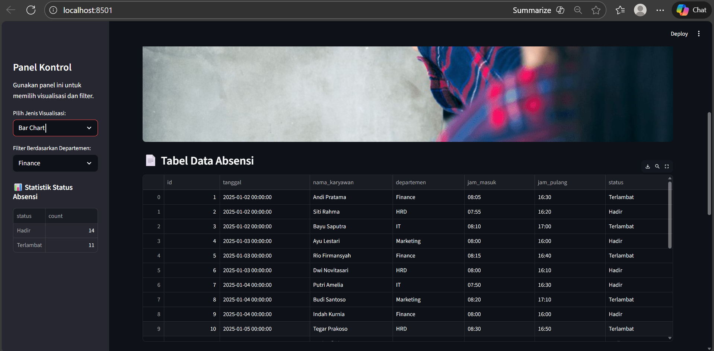
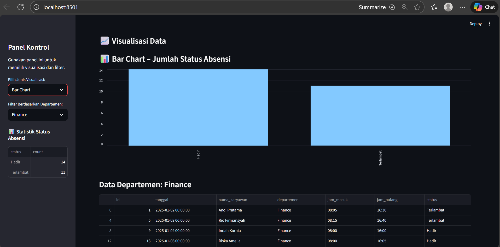
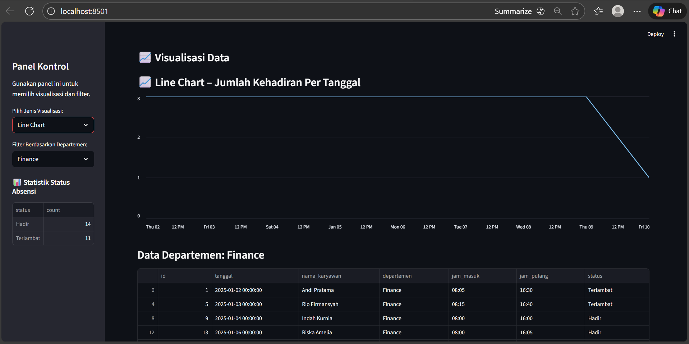
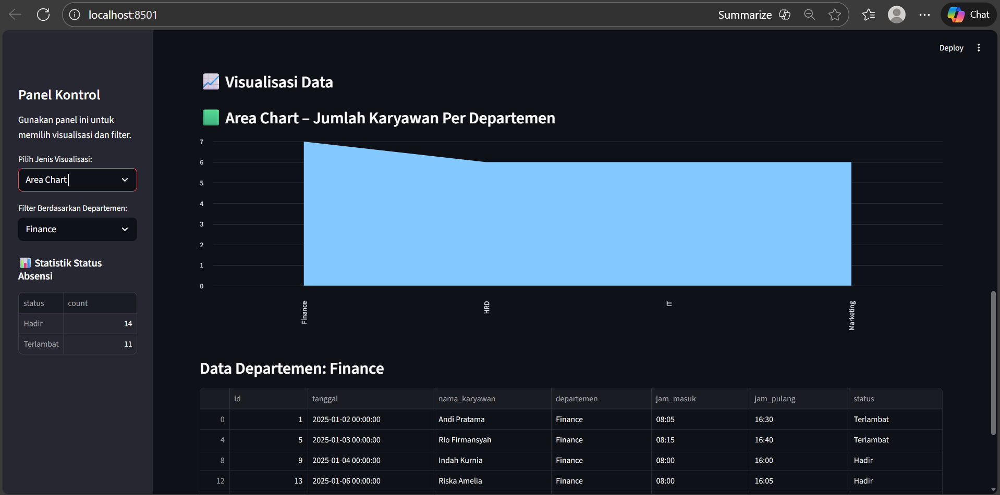
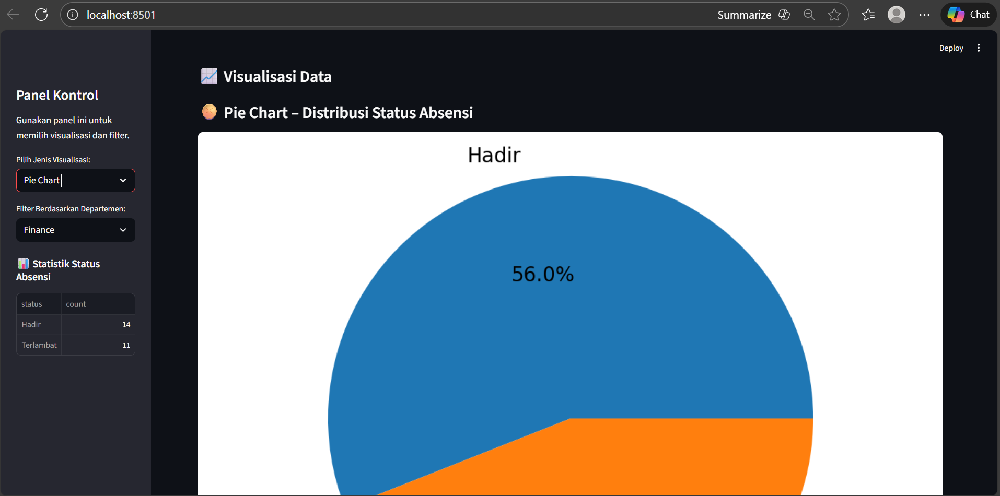
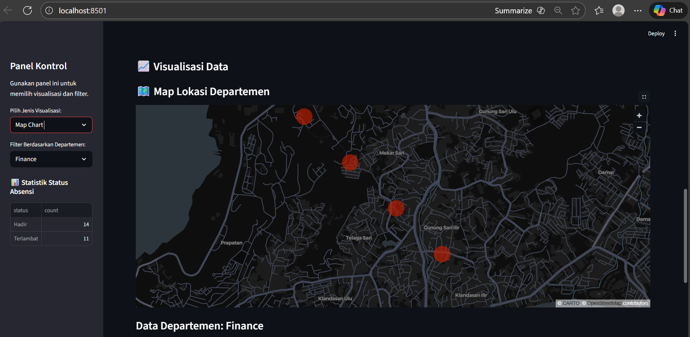

# Laporan Praktikum Ke-3
## Adminitrasi Basis Data
### Nama: Andini Permata Sari
### NIM: 10231015

## 1. Pendahuluan
Dashboard absensi karyawan ini dibuat menggunakan Python dengan bantuan beberapa library, yaitu Streamlit, Pandas, dan Matplotlib. Aplikasi ini menampilkan berbagai bentuk visualisasi seperti bar chart, line chart, area chart, pie chart, dan map chart. Selain itu, aplikasi juga menyediakan sidebar (panel kiri) berisi menu dropdown untuk memilih jenis visualisasi dan filter departemen.

Laporan ini menjelaskan proses pembuatan aplikasi mulai dari persiapan lingkungan, penginstalan modul, penulisan kode, hingga menjalankan aplikasi pada browser.

## 2. Step by Step
### 2.1 Membuat Folder Project 
Langkah pertama adalah membuat sebuah folder khusus untuk project dashboard Streamlit.

nama folder: tugas_praktikum3

lalu buka terminal dan jalankan perintah berikut untuk masuk ke folder project di terminal.

```cd C:\Tugas ABD\tugas_praktikum3```

## 2.2 Instalasi Library yang Dibutuhkan
Project Streamlit ini memerlukan beberapa library Python. Install semuanya menggunakan pip dengan kode berikut:
```
pip install streamlit
pip install pandas
pip install matplotlib
```

## 2.3 Membuat File Program (app.py)
Di dalam folder tugas_praktikum3, buat file baru bernama:
```
app.py
```
lalu isi file tersebut dengan kode berikut:
```py
import streamlit as st
import pandas as pd
import matplotlib.pyplot as plt

def main():
    st.set_page_config(page_title="Dashboard Absensi Karyawan", layout="wide")

    st.title("Dashboard Absensi Karyawan")
    st.write("Visualisasi data absensi harian karyawan.")

    st.image(
        "image.png",
        use_container_width=True
    )

    data = pd.DataFrame({
        "id": range(1, 26),
        "tanggal": [
            "2025-01-02", "2025-01-02", "2025-01-02",
            "2025-01-03", "2025-01-03", "2025-01-03",
            "2025-01-04", "2025-01-04", "2025-01-04",
            "2025-01-05", "2025-01-05", "2025-01-05",
            "2025-01-06", "2025-01-06", "2025-01-06",
            "2025-01-07", "2025-01-07", "2025-01-07",
            "2025-01-08", "2025-01-08", "2025-01-08",
            "2025-01-09", "2025-01-09", "2025-01-09",
            "2025-01-10"
        ],
        "nama_karyawan": [
            "Andi Pratama", "Siti Rahma", "Bayu Saputra",
            "Ayu Lestari", "Rio Firmansyah", "Dwi Novitasari",
            "Putri Amelia", "Budi Santoso", "Indah Kurnia",
            "Tegar Prakoso", "Yuni Safitri", "Arman Fadli",
            "Riska Amelia", "Adit Nugroho", "Dina Wulandari",
            "Fadil Akbar", "Putra Mahendra", "Sarah Oktaviani",
            "Kevin Saputra", "Larasati Dewi", "Hendra Setiawan",
            "Nadia Salma", "Abdi Pratama", "Salsa Maharani",
            "Reza Firmansyah"
        ],
        "departemen": [
            "Finance", "HRD", "IT",
            "Marketing", "Finance", "HRD",
            "IT", "Marketing", "Finance",
            "HRD", "IT", "Marketing",
            "Finance", "HRD", "IT",
            "Marketing", "Finance", "HRD",
            "IT", "Marketing", "Finance",
            "HRD", "IT", "Marketing",
            "Finance"
        ],
        "jam_masuk": [
            "08:05", "07:55", "08:10",
            "08:00", "08:15", "08:00",
            "07:50", "08:20", "08:00",
            "08:30", "07:55", "08:05",
            "08:00", "08:10", "07:50",
            "08:00", "08:25", "08:00",
            "07:55", "08:40", "08:00",
            "08:05", "07:50", "08:00",
            "08:30"
        ],
        "jam_pulang": [
            "16:30", "16:20", "17:00",
            "16:00", "16:40", "16:10",
            "16:30", "17:10", "16:00",
            "16:50", "16:40", "16:30",
            "16:05", "16:20", "16:10",
            "17:00", "16:40", "16:00",
            "16:50", "17:20", "16:15",
            "16:30", "16:20", "17:10",
            "16:55"
        ],
        "status": [
            "Terlambat", "Hadir", "Terlambat",
            "Hadir", "Terlambat", "Hadir",
            "Hadir", "Terlambat", "Hadir",
            "Terlambat", "Hadir", "Terlambat",
            "Hadir", "Terlambat", "Hadir",
            "Hadir", "Terlambat", "Hadir",
            "Hadir", "Terlambat", "Hadir",
            "Terlambat", "Hadir", "Hadir",
            "Terlambat"
        ]
    })

    data["tanggal"] = pd.to_datetime(data["tanggal"])

    st.subheader("📄 Tabel Data Absensi")
    st.dataframe(data)

    # ================================
    # SIDEBAR PANEL
    # ================================
    st.sidebar.title("Panel Kontrol")
    st.sidebar.write("Gunakan panel ini untuk memilih visualisasi dan filter.")

    pilihan = st.sidebar.selectbox(
        "Pilih Jenis Visualisasi:",
        ["Bar Chart", "Line Chart", "Area Chart", "Pie Chart", "Map Chart"]
    )

    dept_filter = st.sidebar.selectbox(
        "Filter Berdasarkan Departemen:",
        data["departemen"].unique()
    )

    # ================================
    # STATISTIK DASAR
    # ================================
    st.sidebar.subheader("📊 Statistik Status Absensi")
    st.sidebar.write(data["status"].value_counts())

    # ================================
    # VISUALISASI
    # ================================
    st.subheader("📈 Visualisasi Data")

    status_counts = data["status"].value_counts()
    absen_per_tanggal = data.groupby("tanggal")["status"].count()
    dept_count = data["departemen"].value_counts()

    if pilihan == "Bar Chart":
        st.write("### 📊 Bar Chart – Jumlah Status Absensi")
        st.bar_chart(status_counts)

    elif pilihan == "Line Chart":
        st.write("### 📈 Line Chart – Jumlah Kehadiran Per Tanggal")
        st.line_chart(absen_per_tanggal)

    elif pilihan == "Area Chart":
        st.write("### 🟩 Area Chart – Jumlah Karyawan Per Departemen")
        st.area_chart(dept_count)

    elif pilihan == "Pie Chart":
        st.write("### 🥧 Pie Chart – Distribusi Status Absensi")
        fig, ax = plt.subplots()
        ax.pie(status_counts, labels=status_counts.index, autopct="%1.1f%%")
        ax.axis("equal")
        st.pyplot(fig)

    elif pilihan == "Map Chart":
        st.write("### 🗺️ Map Lokasi Departemen")
        lokasi = pd.DataFrame({
            "departemen": ["Finance", "HRD", "IT", "Marketing"],
            "latitude": [-1.255, -1.260, -1.265, -1.270],
            "longitude": [116.825, 116.830, 116.835, 116.840]
        })
        st.map(lokasi, latitude="latitude", longitude="longitude")

    # ================================
    # FILTER TABEL
    # ================================
    st.subheader(f"Data Departemen: {dept_filter}")
    st.dataframe(data[data["departemen"] == dept_filter])


if __name__ == "__main__":
    main()
```

## 2.4 Menjalankan Dashboard Streamlit
Setelah file app.py selesai dibuat, jalankan aplikasi Streamlit dari terminal menggunakan kode berikut:
```
streamlit run app.py
```
Jika sukses, terminal akan menampilkan alamat server lokal, seperti:
```
Local URL: http://localhost:8501
```

## 3. Output Hasil Visualisasi
### Tabel data absensi:


### Visualisasi Bar Chart:

Bar chart ini menampilkan jumlah karyawan berdasarkan status absensi, yaitu kategori Hadir dan Terlambat. Setiap batang merepresentasikan satu kategori status, sedangkan tinggi batang menunjukkan jumlah karyawan yang termasuk dalam status tersebut. Visualisasi ini membantu melihat perbandingan kuantitatif antara jumlah karyawan yang hadir tepat waktu dan yang terlambat.

### Visualisasi Line Chart:

Line chart ini menunjukkan jumlah total absensi karyawan untuk setiap tanggal. Setiap titik pada grafik mewakili jumlah absensi pada tanggal tertentu, dan garis yang menghubungkan titik-titik tersebut menggambarkan perubahan atau tren jumlah kehadiran dari hari ke hari. Grafik ini memudahkan dalam mengidentifikasi pola kehadiran harian.

### Visualisasi Area Chart:

Area chart ini menampilkan jumlah karyawan berdasarkan masing-masing departemen (Finance, HRD, IT, Marketing). Setiap area menggambarkan besar kecilnya jumlah karyawan dalam departemen tersebut. Grafik ini memberikan gambaran visual proporsi jumlah karyawan di setiap departemen secara lebih jelas.

### Visualisasi Pie Chart:

Pie chart ini menggambarkan persentase distribusi status absensi karyawan, yaitu antara status Hadir dan Terlambat. Setiap irisan (slice) pada diagram lingkaran menunjukkan besarnya proporsi masing-masing status. Visualisasi ini berguna untuk melihat persentase keterlambatan dibandingkan kehadiran keseluruhan.

### Visualisasi Map Chart:

Map chart ini menampilkan lokasi geografis tiap departemen berdasarkan koordinat latitude dan longitude yang telah ditentukan. Titik-titik pada peta mewakili posisi departemen Finance, HRD, IT, dan Marketing. Visualisasi ini memberikan gambaran spasial terkait sebaran lokasi departemen.